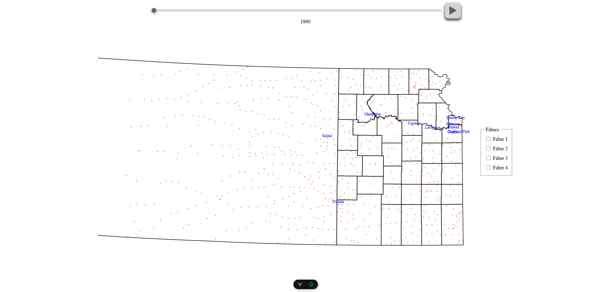

# 01 Launch App

## Open the client appcliation url

The main page should contain 4 main elements:
* The input slider at the top with the year selected displayed below it.
* The play button to the right of the input slider.
* The map below the input slider.
    - The map should contain county borders based on the selected year.
    - The map should contain red dots that represent cities.
    - The ten most populous cities should have their names centered above their corresponding red dot.
* The filter placeholder box to the right of the map.

Example below:

## Completed

You may move onto the next test, `02-input-slider.md`.
